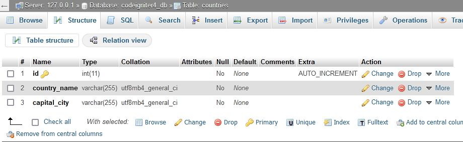

# CodeIgniter 4 Ajax CRUD with Server Side Datatable


<b>What is CodeIgniter?</b> <br>CodeIgniter is a PHP full-stack web framework that is light, fast, flexible and secure.
More information can be found at the [official site](http://codeigniter.com).


#### About Project

This codeigniter 4 project, you will learn how to implement CRUD Operation using Ajax with Server Side DataTable.

###### Requirements:
* [Jquery](https://jquery.com/) 
* [DataTable](https://datatables.net/) 
* [SweetAlert2](https://sweetalert2.github.io/)
* [SSP Class Library](https://github.com/emran/ssp)


<p>After having above required plugins and libraries, make sure that you include css and js files on your layout.</p>

``` html
  <link rel="stylesheet" href="datatable/css/dataTables.bootstrap.css">
  <link rel="stylesheet" href="datatable/css/dataTables.bootstrap4.min.css">
  <link rel="stylesheet" href="sweetalert2/sweetalert2.min.css">
```

``` html
<script src="plugins/jquery/jquery.min.js"></script>
<script src="plugins/bootstrap/js/bootstrap.bundle.min.js"></script>
<script src="datatable/js/jquery.dataTables.min.js"></script>
<script src="datatable/js/dataTables.bootstrap4.min.js"></script>
<script src="sweetalert2/sweetalert2.min.js"></script>
```

<p>_Countries Table Structure_</p>



<p>_Routes_</p>

``` php
 $routes->group("user",function($routes){
    $routes->get('home','UserController::index',['as'=>'user.home']);
    $routes->get('profile','UserController::profile',['as'=>'user.profile']);
    $routes->get('countries','UserController::countries',['as'=>'countries']);
    $routes->post('addCountry','UserController::addCountry',['as'=>'add.country']);
    $routes->get('getAllCountries','UserController::getAllCountries',['as'=>'get.all.countries']);
    $routes->post('getCountryInfo','UserController::getCountryInfo',['as'=>'get.country.info']);
    $routes->post('updateCountry','UserController::updateCountry',['as'=>'update.country']);
    $routes->post('deleteCountry','UserController::deleteCountry',['as'=>'delete.country']);
});
```


## 1) Insert data into database with ajax


<p><b><u>Add new Country Form</u></b></p>

``` html
<form action="<?= route_to('add.country'); ?>" method="post" id="add-country-form" autocomplete="off">
    <?= csrf_field(); ?>
    <div class="form-group">
        <label for="">Country name</label>
        <input type="text" class="form-control" name="country_name" placeholder="Enter country name">
        <span class="text-danger error-text country_name_error"></span>
    </div>
    <div class="form-group">
        <label for="">Capital city</label>
        <input type="text" class="form-control" name="capital_city" placeholder="Enter capital city">
        <span class="text-danger error-text capital_city_error"></span>
    </div>
    <div class="form-group">
        <button type="submit" class="btn btn-block btn-success">Save</button>
    </div>
</form>
```

<p><b><u>Scripts</u></b></p>

``` javascript
  //ADD NEW COUNTRY
   $('#add-country-form').submit(function(e){
        e.preventDefault();
        var form = this;
        $.ajax({
           url:$(form).attr('action'),
           method:$(form).attr('method'),
           data:new FormData(form),
           processData:false,
           dataType:'json',
           contentType:false,
           beforeSend:function(){
              $(form).find('span.error-text').text('');
           },
           success:function(data){
                 if($.isEmptyObject(data.error)){
                     if(data.code == 1){
                         $(form)[0].reset();
                         $('#countries-table').DataTable().ajax.reload(null, false);
                     }else{
                         alert(data.msg);
                     }
                 }else{
                     $.each(data.error, function(prefix, val){
                         $(form).find('span.'+prefix+'_error').text(val);
                     });
                 }
           }
        });
   });
```

<p><b><u>Add new Country method</u></b></p>

``` php
  public function addCountry(){
        $countryModel = new \App\Models\Country();
        $validation = \Config\Services::validation();
        $this->validate([
             'country_name'=>[
                 'rules'=>'required|is_unique[countries.country_name]',
                 'errors'=>[
                     'required'=>'Country name is required',
                     'is_unique'=>'This country is already exists',
                 ]
             ],
             'capital_city'=>[
                  'rules'=>'required',
                  'errors'=>[
                      'required'=>'Capital city is required'
                  ]
             ]
        ]);

        if($validation->run() == FALSE){
            $errors = $validation->getErrors();
            echo json_encode(['code'=>0, 'error'=>$errors]);
        }else{
             //Insert data into db
             $data = [
                 'country_name'=>$this->request->getPost('country_name'),
                 'capital_city'=>$this->request->getPost('capital_city'),
             ];
             $query = $countryModel->insert($data);
             if($query){
                 echo json_encode(['code'=>1,'msg'=>'New country has been saved to database']);
             }else{
                 echo json_encode(['code'=>0,'msg'=>'Something went wrong']);
             }
        }
    }

```


## 2) Retrieving data from database with Server side datatable

<p><b><u>Basic table</u></b></p>

``` html
<table class="table table-hover" id="countries-table">
    <thead>
        <th>#</th>
        <th>Country name</th>
        <th>Capital city</th>
        <th>Actions</th>
    </thead>
    <tbody></tbody>
</table>
```

<p><b><u>Get All countries method</u></b></p>

*Add this construct function above all methods*

``` php
 public function __construct(){
        require_once APPPATH.'ThirdParty/ssp.php';
        $this->db = db_connect();
  }
```

*Get All countries method*
``` php
public function getAllCountries(){
        //DB Details
        $dbDetails = array(
            "host"=>$this->db->hostname,
            "user"=>$this->db->username,
            "pass"=>$this->db->password,
            "db"=>$this->db->database,
        );

        $table = "countries";
        $primaryKey = "id";

        $columns = array(
            array(
                "db"=>"id",
                "dt"=>0,
            ),
            array(
                "db"=>"country_name",
                "dt"=>1,
            ),
            array(
                "db"=>"capital_city",
                "dt"=>2,
            ),
            array(
                "db"=>"id",
                "dt"=>3,
                "formatter"=>function($d, $row){
                    return "<div class='btn-group'>
                                  <button class='btn btn-sm btn-primary' data-id='".$row['id']."' id='updateCountryBtn'>Update</button>
                                  <button class='btn btn-sm btn-danger' data-id='".$row['id']."' id='deleteCountryBtn'>Delete</button>
                             </div>";
                }
            ),
        );

        echo json_encode(
            \SSP::simple($_GET, $dbDetails, $table, $primaryKey, $columns)
        );
    }
```

<p><b><u>SetUp DataTable</u></b></p>

``` javascript
   $('#countries-table').DataTable({
       "processing":true,
       "serverSide":true,
       "ajax":"<?= route_to('get.all.countries'); ?>",
       "dom":"lBfrtip",
       stateSave:true,
       info:true,
       "iDisplayLength":5,
       "pageLength":5,
       "aLengthMenu":[[5,10,25,50,-1],[5,10,25,50,"All"]],
       "fnCreatedRow": function(row, data, index){
           $('td',row).eq(0).html(index+1);
       }
   });
```


## 3) Updating data

*You need to add this meta tag on your page*


``` javascript
<meta name="<?= csrf_token() ?>" content="<?= csrf_hash() ?>" class="csrf">
```

*Define the following variables on your scripts*

``` javascript
 var csrfName = $('meta.csrf').attr('name'); //CSRF TOKEN NAME
 var csrfHash = $('meta.csrf').attr('content'); //CSRF HASH
```

*Include edit country modal*
``` php
<?= $this->include('modals/editCountryModal'); ?>
```

<p><b><u>Edit country modal and form</u></b></p>

``` html
<div class="modal fade editCountry" tabindex="-1" role="dialog" aria-labelledby="exampleModalLabel" aria-hidden="true" data-keyboard="false" data-backdrop="static">
    <div class="modal-dialog modal-dialog-centered" role="document">
        <div class="modal-content">
            <div class="modal-header">
                <h5 class="modal-title" id="exampleModalLabel">Edit Country</h5>
                <button type="button" class="close" data-dismiss="modal" aria-label="Close">
                    <span aria-hidden="true">&times;</span>
                </button>
            </div>
            <div class="modal-body">
                    <form action="<?= route_to('update.country'); ?>" method="post" id="update-country-form">
                    <?= csrf_field(); ?>
                    <input type="hidden" name="cid">
                           <div class="form-group">
                              <label for="">Country name</label>
                              <input type="text" class="form-control" name="country_name" placeholder="Enter country name">
                              <span class="text-danger error-text country_name_error"></span>
                           </div>
                           <div class="form-group">
                               <label for="">Capital city</label>
                               <input type="text" class="form-control" name="capital_city" placeholder="Enter capital city"> 
                               <span class="text-danger error-text capital_city_error"></span>
                           </div>
                           <div class="form-group">
                              <button type="submit" class="btn btn-block btn-success">Save Changes</button>
                           </div>
                    </form>
            </div>
        </div>
    </div>
</div>
```

<p><b><u>Getting Single Country details Scripts</u></b></p>

``` javascript
$(document).on('click','#updateCountryBtn', function(){
       var country_id = $(this).data('id');
        
        $.post("<?= route_to('get.country.info') ?>",{country_id:country_id, [csrfName]:csrfHash}, function(data){
            //   alert(data.results.country_name);

            $('.editCountry').find('form').find('input[name="cid"]').val(data.results.id);
            $('.editCountry').find('form').find('input[name="country_name"]').val(data.results.country_name);
            $('.editCountry').find('form').find('input[name="capital_city"]').val(data.results.capital_city);
            $('.editCountry').find('form').find('span.error-text').text('');
            $('.editCountry').modal('show');
        },'json');

    
   });
```

<p><b><u>Getting Country details</u></b></p>

``` php
public function getCountryInfo(){
        $countryModel = new \App\Models\Country();
        $country_id = $this->request->getPost('country_id');
        $info = $countryModel->find($country_id);
        if($info){
            echo json_encode(['code'=>1, 'msg'=>'', 'results'=>$info]);
        }else{
            echo json_encode(['code'=>0, 'msg'=>'No results found', 'results'=>null]);
        }
    }
```


<p><b><u>Updating selected country js scripts</u></b></p>

``` javascript
   $('#update-country-form').submit(function(e){
       e.preventDefault();
       var form = this;

       $.ajax({
           url: $(form).attr('action'),
           method:$(form).attr('method'),
           data: new FormData(form),
           processData: false,
           dataType:'json',
           contentType:false,
           beforeSend:function(){
               $(form).find('span.error-text').text('');
           },
           success:function(data){

               if($.isEmptyObject(data.error)){

                   if(data.code == 1){
                    $('#countries-table').DataTable().ajax.reload(null, false);
                     $('.editCountry').modal('hide');
                   }else{
                       alert(data.msg);
                   }

               }else{
                   $.each(data.error, function(prefix, val){
                       $(form).find('span.'+prefix+'_error').text(val);
                   });
               }
           }
       });
   });
```

<p><b><u>Updating selected country method</u></b></p>

``` php
 public function updateCountry(){
        $countryModel = new \App\Models\Country();
        $validation = \Config\Services::validation();
        $cid = $this->request->getPost('cid');

        $this->validate([
            'country_name'=>[
                 'rules'=>'required|is_unique[countries.country_name,id,'.$cid.']',
                 'errors'=>[
                      'required'=>'Country name is required',
                      'is_unique'=>'This country is already exists'
                 ]
            ],
            'capital_city'=>[
                  'rules'=>'required',
                  'errors'=>[
                      'required'=>'Capital city is required'
                  ]
            ]
        ]);

        if($validation->run() == FALSE){
            $errors = $validation->getErrors();
            echo json_encode(['code'=>0,'error'=>$errors]);
        }else{
            //Update country
            $data = [
               'country_name'=>$this->request->getPost('country_name'),
               'capital_city'=>$this->request->getPost('capital_city'),
            ];
            $query = $countryModel->update($cid,$data);

            if($query){
                echo json_encode(['code'=>1, 'msg'=>'Country info have been updated successfully']);
            }else{
                echo json_encode(['code'=>0, 'msg'=>'Something went wrong']);
            }
        }
    }
```

 
## 4) Deleting data

<p><b><u>Confirm deleting country with sweetalert2</u></b></p>

``` javascript
$(document).on('click', '#deleteCountryBtn', function(){
       var country_id = $(this).data('id');
       var url = "<?= route_to('delete.country'); ?>";

       swal.fire({

           title:'Are you sure?',
           html:'You want to delete this country',
           showCloseButton:true,
           showCancelButton:true,
           cancelButtonText:'Cancel',
           confirmButtonText:'Yes, delete',
           cancelButtonColor:'#d33',
           confirmButtonColor:'#556eeb',
           width:300,
           allowOutsideClick:false

       }).then(function(result){
            if(result.value){

                $.post(url,{[csrfName]:csrfHash, country_id:country_id}, function(data){
                     if(data.code == 1){
                        $('#countries-table').DataTable().ajax.reload(null, false);
                     }else{
                         alert(data.msg);
                     }
                },'json');
            }
       });
   });
```

<p><b><u>Delete country method</u></b></p>

``` php
public function deleteCountry(){
        $countryModel = new \App\Models\Country();
        $country_id = $this->request->getPost('country_id');
        $query = $countryModel->delete($country_id);

        if($query){
            echo json_encode(['code'=>1,'msg'=>'Country deleted Successfully']);
        }else{
            echo json_encode(['code'=>0,'msg'=>'Something went wrong']);
        }
    }

```
